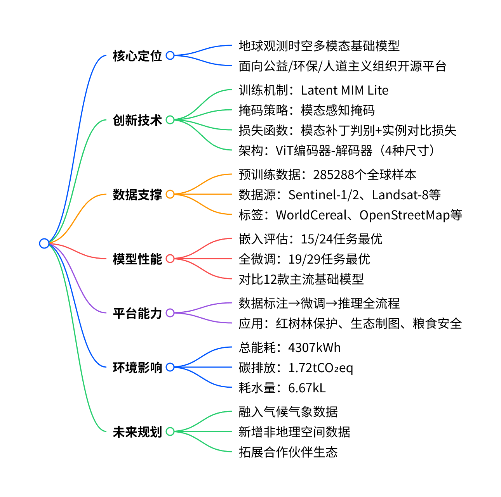
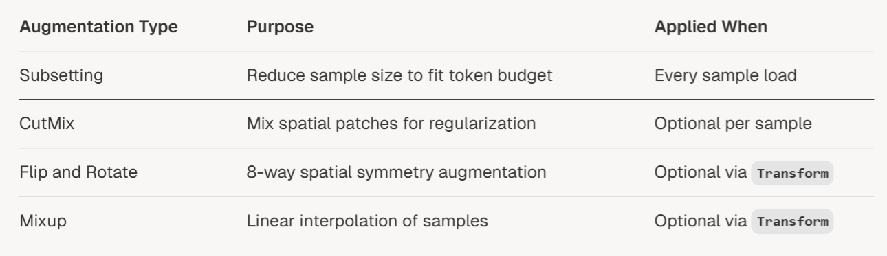
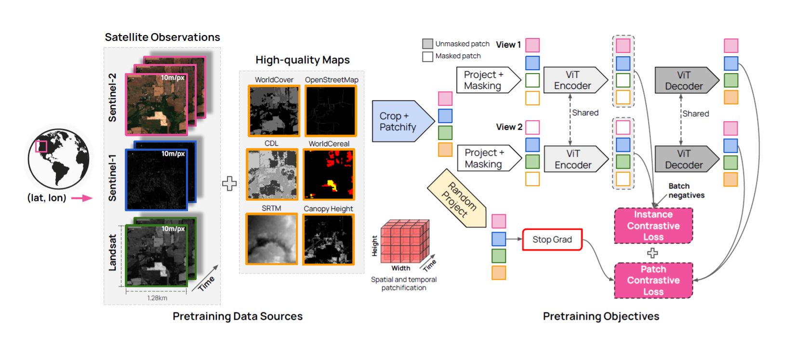

# OlmoEarth 总结
## 概述

**OlmoEarth**是由**艾伦人工智能研究所**推出的**时空多模态地球观测基础模型**，基于**ViT架构**设计**Latent MIM Lite**稳定训练机制，搭配**模态感知掩码**与**模态感知损失**，在**24项嵌入任务**中拿下**15项最优**、**29项全微调任务**拿下**19项最优**，并依托**OlmoEarth平台**为公益与环保组织提供端到端工具，开源代码、数据与权重，兼顾**性能-效率最优**与**低环境影响**。

#### 1. 模型背景与核心目标
地球观测数据具备**空间性、时序性、多模态**特征，现有基础模型存在**训练不稳定、部署成本高、公益领域落地难**问题，OlmoEarth旨在打造**稳定高效、开源易用**的地球观测基础模型，赋能非营利组织解决环保、气候、粮食安全等问题。

#### 2. 核心技术创新

1. **Latent MIM Lite 落地**：用「冻结随机投影+Stop Grad」替代传统可学习目标编码器，彻底解决训练不稳定、表征崩溃问题
2. **自监督+监督统一**：卫星数据走自监督掩码重建，地图数据走监督目标对齐，共享同一套ViT架构、同一套损失函数
3. **模态感知设计**：不同模态（卫星/地图）用不同颜色区分，掩码策略、损失计算都做了模态适配，结合随机令牌掩码与全模态重建，无需超高掩码比例即可提升任务难度，地图数据仅用于解码，观测数据可编码/解码/两者兼具。
4. **损失函数设计**：
   - **模态补丁判别损失**：仅同模态令牌对比，剔除易负样本
   - **实例对比损失**：全局池化聚合特征，强化整体表征能力
5. **时空建模**：Patchify 是三维时空分块，Encoder/Decoder 天然支持时序特征学习，适配地球观测的时间序列特性

基于**Vision Transformer**的编码器-解码器结构，提供**4种参数规模**：

| 模型尺寸 | 编码器深度 | 特征维度 | 参数规模 |
| --- | --- | --- | --- |
| Nano | 4 | 128 | 1.4M |
| Tiny | 12 | 192 | 6.2M |
| Base | 12 | 768 | 90M |
| Large | 24 | 1024 | 300M |

#### 3. 预训练数据
- 样本量：**285288个**全球样本
- 空间范围：2.56km×2.56km，分辨率统一为**10米/像素**
- 时间范围：2016.01-2024.12，单样本覆盖**1年**，最多**12个时间步**
- 数据源：卫星（Sentinel-1/2、Landsat-8）+地图（WorldCereal、OpenStreetMap等）

#### 4. 性能评估结果
- 对比**12款**主流地球观测基础模型
- **嵌入评估（kNN/线性探测）**：**15/24**项任务最优
- **全微调**：**19/29**项任务最优
- 实现**性能-计算效率帕累托最优**

#### 5. OlmoEarth开源平台
- 定位：端到端地球观测模型工具平台，**免费向公益组织开放**
- 流程：数据收集→标注→训练→推理一站式服务
- 落地案例：红树林保护（F1值98.1%）、全球生态制图、肯尼亚土地分类等

#### 6. 环境影响
总训练能耗**4307kWh**、碳排放**1.72tCO₂eq**、耗水**6.67kL**，各型号能耗如下：

| 模型 | 预训练GPU时长 | 能耗(kWh) | 碳排放(tCO₂eq) | 耗水(kL) |
| --- | --- | --- | --- | --- |
| Nano | 1149 | 195 | 0.08 | 0.30 |
| Tiny | 1149 | 205 | 0.08 | 0.32 |
| Base | 2989 | 803 | 0.32 | 1.24 |
| Large | 5240 | 1933 | 0.77 | 2.99 |

#### 7. 未来规划
- 融入**气候与气象数据**，支持野火预测、作物产量预估
- 新增**非地理空间数据**（地理定位自然图像）
- 持续优化平台，扩大公益合作伙伴生态

---

## 技术细节
### 训练数据
| 项目 | 详细内容 |
| :--- | :--- |
| **数据集名称** | olmoearth\_pretrain\_dataset |
| **样本总数** | 285,288 个全球地理样本 |
| **单样本空间大小** | 2.56 km × 2.56 km |
| **统一空间分辨率** | 10 m/像素（所有模态重采样到此分辨率） |
| **时间覆盖范围** | 2016 年 1 月 — 2024 年 12 月 |
| **单样本时序配置** | 覆盖 1 年；按月采样，最多 12 个时间步；支持模态/时间步缺失 |
| **卫星观测数据（自监督）** | • Sentinel‑1（SAR 雷达，全天候） • Sentinel‑2（光学多光谱） • Landsat‑8（光学多光谱） |
| **地图标签数据（监督）** | • WorldCereal（全球作物） • WorldCover（全球土地覆盖） • OpenStreetMap（OSM 地物） • Cropland Data Layer（CDL 农田） • SRTM（数字高程） • Canopy Height Map（冠层高度） |
| **波段组 Bandset 划分** | • Sentinel‑2：分为 3 个波段组（按原始分辨率） • Landsat‑8：分为 2 个波段组（按原始分辨率） 作用：用于模态感知掩码与模态感知损失 |
| **空间采样策略** | 基于 OpenStreetMap 120 类地物类别采样；每类最多采样 10,000 块；保证全球地表类型均衡覆盖 |
| **时间采样策略** | 随机选取 1 年时间窗口；时间步均匀分布；允许部分时间步/模态缺失以增强鲁棒性 |
| **数据预处理** | • 空间统一重采样到 10 m • 时空裁剪到固定尺寸 • 分块（Patchify）为时空块 • 按传感器统计量归一化 |
| **训练中的角色** | • 卫星观测：用于掩码重建，可编码、可掩码、可做预测目标 • 地图标签：仅用于解码，不参与编码；经冻结随机投影生成监督目标 |
| **核心数据特性** | 多模态对齐、长时序、全球均衡、高质量标签、分辨率统一、支持缺失模态 |

##### 数据预处理

##### 数据增强策略

### 模型架构

这张图完整展示了 **OlmoEarth 模型的预训练数据来源 + 核心训练目标（Latent MIM Lite 机制)**。

在这张图里，监督学习的完整链路是：
`High-quality Maps（地图标签） → Crop+Patchify → Random Project → Stop Grad → 生成固定监督目标 → Patch Contrastive Loss 计算损失 → 反向传播更新 ViT Encoder/Decoder`

而自监督的链路是：
`Satellite Observations（卫星数据） → Crop+Patchify → Project+Masking → ViT Encoder → ViT Decoder → 预测掩码补丁 → Patch Contrastive Loss 计算损失 → 反向传播更新`

两者在 `Patch Contrastive Loss` 处汇合，用同一个损失完成两种学习，这是 OlmoEarth 最核心的设计。

#### 一、左半部分：Pretraining Data Sources（预训练数据来源）
这部分是模型的「输入原料」，分为两大类：**卫星观测数据（自监督信号）** 和 **高质量地图标签（监督信号）**，两者在同一经纬度、同一时间窗口下对齐。

##### 1. Satellite Observations（卫星观测数据 → 自监督学习的核心输入）
- **数据源**：Sentinel-2（光学，粉色框）、Sentinel-1（雷达，蓝色框）、Landsat（多光谱，绿色框）
- **空间规格**：统一分辨率 **10m/像素**，单张图覆盖 **1.28km × 1.28km**（对应后续分块）
- **时间维度**：沿「Time」轴堆叠，单样本覆盖1年，最多12个时间步，形成**时空序列数据**
- **作用**：作为自监督学习的输入，通过掩码重建学习通用地球表征

##### 2. High-quality Maps（高质量地图标签 → 监督学习的核心输入）
- **数据源**：WorldCover（土地覆盖）、OpenStreetMap（地物）、CDL（农田分类）、WorldCereal（作物）、SRTM（高程）、Canopy Height（冠层高度）等
- **特点**：都是**人工标注/权威开源的标签数据**，不是原始观测，是「监督信号」
- **作用**：作为监督学习的目标，让模型学习到明确语义的地理特征
- **对应问题**：**这一整块就是监督学习的数据来源**，后续会通过「Random Project」生成固定的监督目标

#### 二、右半部分：Pretraining Objectives（预训练目标 & Latent MIM Lite 机制）
这部分是模型的「训练逻辑」，完整实现了 **Latent MIM Lite + 双对比损失**，同时融合自监督与监督学习。

##### 0. 随机投影原理分析
论文原文明确写了：
> Randomly projecting raw input data extracts valuable features both from a theoretical and practical standpoint.
> While it’s possible this approach is too simplistic in natural images, **empirical results show a clear benefit in Earth observation data.**

翻译：**随机投影在理论和实践上都能提取有效特征；在自然图像可能太简单，但在地球观测数据上效果显著、非常稳。**

- 随机线性投影能**近似保留数据的几何结构**
- 高维数据 → 随机投影 → 低维嵌入，**相似性基本不变**
- 地球观测数据（卫星、光谱、地形）**高维、冗余极强**，特别适合随机投影

**为什么“随机初始化、不训练”的线性层居然能用？**

###### 随机投影本身就是一种有效特征提取（数学已证明）
这不是瞎猜，是**机器学习经典理论**：
- 随机线性投影能**近似保留数据的几何结构**
- 高维数据 → 随机投影 → 低维嵌入，**相似性基本不变**
- 地球观测数据（卫星、光谱、地形）**高维、冗余极强**，特别适合随机投影

###### 我们不是让它“学特征”，只是让它“做靶子”
Latent MIM Lite 里的随机投影 W **只干一件事：生成固定目标**。
它不需要精准、不需要语义强，只需要满足两点：
1. **固定不变**（训练稳定）
2. **能区分不同patch**（让模型有东西可学）

随机线性层完美满足：
- 不同patch → 投影后不一样
- 相似patch → 投影后也相似
- 全程不动 → 梯度超级稳

**模型的编码器才是真正学特征的，W 只是个“固定靶子”。**

###### 地球观测数据的特性，让随机投影效果翻倍
卫星遥感数据有 3 个特点，特别适配随机投影：
1. **波段多、维度高**（Sentinel-2 有 12 波段）
2. **空间冗余极强**（相邻像素很像）
3. **模态内部结构稳定**（水体、植被、城市光谱固定）

随机投影能**无损保留这些结构**，不需要复杂编码器。

###### 会不会因为“随机”导致每次训练结果不一样？
答案：**会有微小差异，但几乎不影响最终性能！**

原因：
1. **随机投影是线性的、平滑的**，不会引入剧烈波动
2. 模型是**编码器在学习**，不是靠投影层
3. 论文做过实验：**换不同随机种子，性能几乎不变**

换句话说：**靶子只要固定、只要能区分，长什么样不重要。**

###### 为什么传统 Latent MIM 会崩，而随机投影不会？
| 方法 | 目标生成 | 为什么会崩/不会崩 |
|------|----------|-------------------|
| 传统 Latent MIM | 可学习目标编码器 | **编码器和目标编码器互更新** → 目标一直在动 → 训练震荡、表征坍塌 |
| Latent MIM Lite | **随机冻结投影** | **目标完全固定** → 梯度稳定 → 从不坍塌 |

**随机 = 不动 = 稳定 = 好用**

###### 精炼总结
1. **随机线性投影在理论上可保留数据几何结构**
2. **地球观测高维冗余数据特别适合随机投影**
3. **投影层只做固定目标，不负责特征学习**
4. **冻结随机投影彻底解决训练不稳定与表征崩溃**
5. **随机初始化不会带来性能波动，反而提升鲁棒性**

##### 1. 第一步：Crop + Patchify（裁剪 + 分块）
- 把左半部分的卫星图/地图，切成 **空间×时间** 的三维补丁（patch），形成「Height × Width × Time」的时空块
- 不同模态（卫星/地图）的补丁，用不同颜色区分（粉/蓝/绿/橙），对应不同数据源

##### 2. 第二步：双路径处理（自监督 vs 监督）
###### 路径A：卫星数据 → 自监督学习（View 1 / View 2）
- 操作：**Project + Masking（投影 + 掩码）**
  - 对卫星补丁做线性投影，然后随机掩码（灰色=未掩码，白色=掩码）
  - 用两个不同的掩码视图（View 1/View 2）做数据增强，提升鲁棒性
- 后续：输入 **共享权重的 ViT Encoder**，编码可见补丁的特征；再输入 **共享权重的 ViT Decoder**，预测被掩码补丁的隐特征
- 本质：自监督的「掩码重建」任务，学习通用时空表征

###### 路径B：地图标签 → 监督学习（Random Project + Stop Grad）
- 操作：**Random Project（随机投影） + Stop Grad（停止梯度）**
  - 对地图标签补丁，用**随机初始化、全程冻结**的线性层做投影（就是 Latent MIM Lite 的核心设计）
  - `Stop Grad` 红框：**强制梯度不回传，投影层全程不更新**，相当于把「监督目标」固定死
- 作用：生成**固定不变的监督目标令牌**，让解码器的预测结果向它对齐
- 对应问题：**这一整条路径，就是监督学习的核心**
  - 地图标签 → 冻结投影 → 固定监督目标 → 损失计算 → 更新编码器/解码器
  - 完全符合「统一自监督+监督流程」的设计：两种学习用同一套损失、同一套架构

##### 3. 第三步：双对比损失（Instance + Patch Contrastive Loss）
两个损失叠加，同时优化全局和局部特征：
###### （1）Instance Contrastive Loss（实例对比损失）
- 作用：**全局特征对齐**
- 逻辑：把同一实例（同一张时空图）的两个视图特征，拉近距离；把不同实例（Batch negatives，批次内其他样本）的特征推远
- 效果：让模型学习到「同一地理区域的全局一致性」，区分不同场景

###### （2）Patch Contrastive Loss（补丁对比损失）
- 作用：**局部特征对齐**
- 逻辑：让解码器预测的补丁特征，和「随机投影生成的固定目标补丁」（自监督/监督的目标）尽可能接近
- 本质：Latent MIM Lite 的核心重建损失，同时适配自监督（卫星补丁）和监督（地图补丁）
- 关键：**同模态对比**，只让卫星补丁和卫星目标、地图补丁和地图目标对比，避免跨模态干扰

#### 
### 掩码策略

### 损失函数